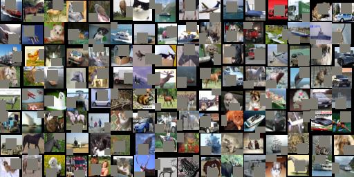
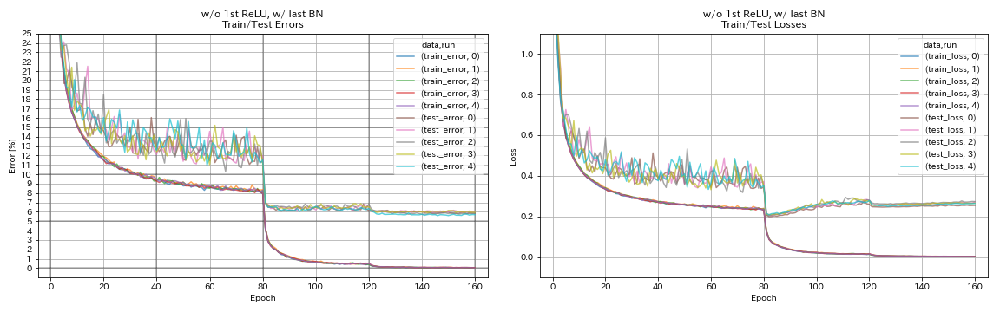
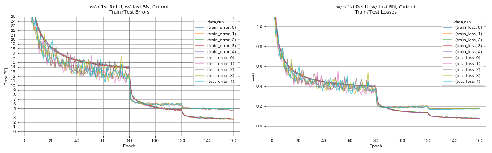

# PyTorch Implementation of Cutout



## Usage

```
$ python main.py --block_type basic --depth 110 --use_cutout --cutout_size 16 --cutout_prob 1 --outdir results
```


## Results on CIFAR-10

| Model                       | Test Error (median of 5 runs) | Training Time |
|:----------------------------|:-----------------------------:|--------------:|
| ResNet-preact-56 w/o Cutout | 5.85                          |    98 min     |
| ResNet-preact-56 w/ Cutout  | 4.96                          |    98 min     |

### w/o Cutout
```
$ python -u main.py --depth 56 --block_type basic --base_lr 0.2 --seed 7 --outdir results/wo_cutout/00
```



### w/ Cutout
```
$ python -u main.py --depth 56 --block_type basic --base_lr 0.2 --use_cutout --cutout_size 16 --cutout_prob 1 --seed 7 --outdir results/w_cutout/00
```




## References

* DeVries, Terrance, and Graham W. Taylor. "Improved regularization of convolutional neural networks with cutout." arXiv preprint arXiv:1708.04552 (2017). [arXiv:1708.04552]( https://arxiv.org/abs/1708.04552 ), [PyTorch implementation]( https://github.com/uoguelph-mlrg/Cutout )


